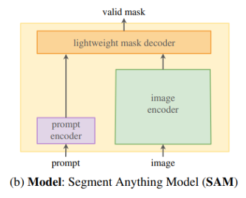
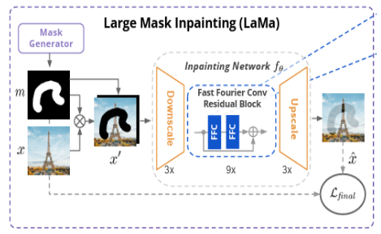

# 인물 『 애니메이션 』 화 프로젝트 

### 앗, 『이 세계』로부터의 손님이 내게 찾아왔다!?
#### 여기 애니화된 사진이 있으면 좋을듯?

<!--   
  -->

## Visits

  

## Team Members

|                                                                           [김지현](https://github.com/codehyunn)                                                                           |                                                                           [박상필](https://github.com/SangphilPark)                                                                           |                                                                           [오동혁](https://github.com/97DongHyeokOH)                                                                           |                                                                           [이상민](https://github.com/dldltkdals)                                                                           |                                                                           [이태순](https://github.com/LTSGOD)                                                                           |
| :--------------------------------------------------------------------------------------------------------------------------------------------------------: | :--------------------------------------------------------------------------------------------------------------------------------------------------------: | :--------------------------------------------------------------------------------------------------------------------------------------------------------: | :--------------------------------------------------------------------------------------------------------------------------------------------------------: | :--------------------------------------------------------------------------------------------------------------------------------------------------------: |
|  |  |  |  |  |
| 모델 엔지니어링 및 학습  | 모델 엔지니어링 및 학습  | 서비스 파이프라인 구축 | 모델 파이프라인 구축 | 웹 서비스, 클라우드 구축 |

## Introduction

### 프로젝트 동기
- 애니메이션과 웹툰 매니아 층은 정식으로 제공되는 컨텐츠를 넘어 부가적인 창작물을 소비
- CV 분야의 생성 기술을 **애니메이션 및 웹툰**에 적용하여 **자신만의 콘텐츠 제작**을 돕고자 함

### 기대효과
- **애니메이션 및 웹툰 플랫폼**에서 활용 가능
- Instagram, TikTok, YouTube 등 **소셜 미디어의 파급효과** 기대
- **디지털 콘텐츠 창작 혁명**의 시작 기능

## Dataset
- 네이버 웹툰 및 애니메이션 캐릭터 사진 데이터

## Model
- Model Pipeline

    

- SAM - 인물 추출에 사용

    

- LAMA - 인물이 제거된 배경 생성에 사용

    

- Stable Diffusion - 캐릭터 생성에 사용

    

## Product Serving

## Demo

## Future Works
- 모델 경량화를 통한 서비스 시간 단축
- 사용자가 원하는 그림체 자동 학습 파이프라인 구축
- 사용자 편의에 맞게 UI/UX 개선
