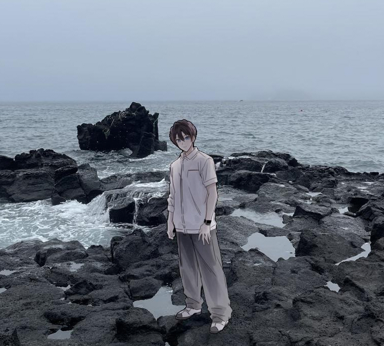
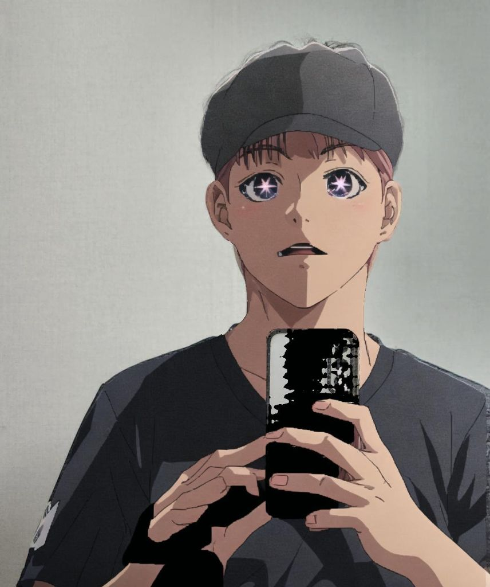
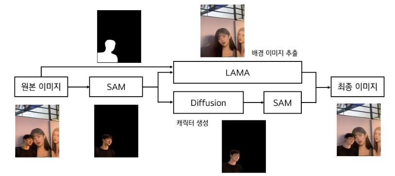
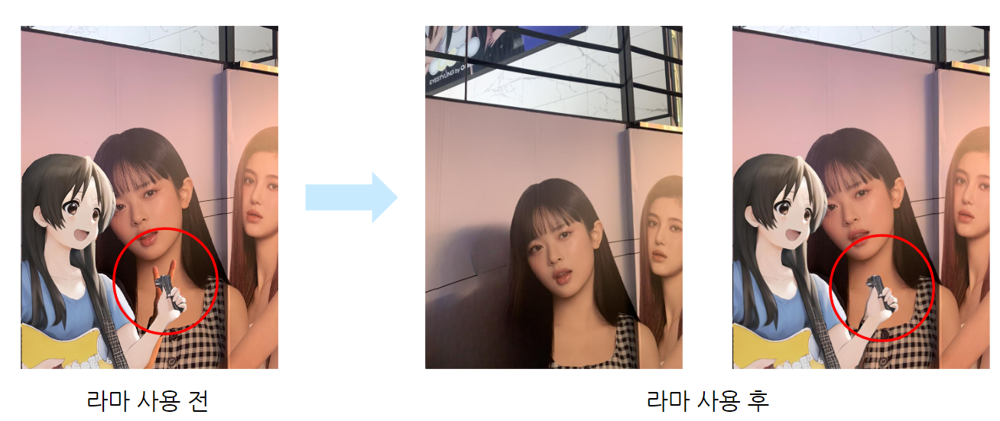

# 인물 『 애니메이션 』 화 프로젝트 

### 앗, 『이 세계』로부터의 손님이 내게 찾아왔다!?

  

    

      

        
      

      

        <svg class="arrow" viewBox="0 0 60 30" fill="none" xmlns="http://www.w3.org/2000/svg">
          <path d="M0 15L60 15M60 15L45 0M60 15L45 30" stroke="black" stroke-width="3"/>
        </svg>
      

      

        
      

    

    

      

        
      

      

        <svg class="arrow" viewBox="0 0 60 30" fill="none" xmlns="http://www.w3.org/2000/svg">
          <path d="M0 15L60 15M60 15L45 0M60 15L45 30" stroke="black" stroke-width="3"/>
        </svg>
      

      

        
      

    

    

      

        
      

      

        <svg class="arrow" viewBox="0 0 60 30" fill="none" xmlns="http://www.w3.org/2000/svg">
          <path d="M0 15L60 15M60 15L45 0M60 15L45 30" stroke="black" stroke-width="3"/>
        </svg>
      

      

        
      

    

  

## Visits

  

## Team Members

|                                                                           [김지현](https://github.com/codehyunn)                                                                           |                                                                           [박상필](https://github.com/SangphilPark)                                                                           |                                                                           [오동혁](https://github.com/97DongHyeokOH)                                                                           |                                                                           [이상민](https://github.com/dldltkdals)                                                                           |                                                                           [이태순](https://github.com/LTSGOD)                                                                           |
| :--------------------------------------------------------------------------------------------------------------------------------------------------------: | :--------------------------------------------------------------------------------------------------------------------------------------------------------: | :--------------------------------------------------------------------------------------------------------------------------------------------------------: | :--------------------------------------------------------------------------------------------------------------------------------------------------------: | :--------------------------------------------------------------------------------------------------------------------------------------------------------: |
|  |  |  |  |  |
| 모델 엔지니어링 및 학습  | 모델 엔지니어링 및 학습  | 서비스 파이프라인 구축 | 모델 파이프라인 구축 | 웹 서비스, 클라우드 구축 |

## Introduction

### 프로젝트 동기
- 애니메이션과 웹툰 매니아 층은 정식으로 제공되는 컨텐츠를 넘어 부가적인 창작물을 소비
- CV 분야의 생성 기술을 **애니메이션 및 웹툰**에 적용하여 **자신만의 콘텐츠 제작**을 돕고자 함
- 전체적인 이미지를 변경해주는 기존 서비스들과 달리 **인물만 골라서 원하는 캐릭터로 변환**해주는 서비스 기획

### 기대효과
- **애니메이션 및 웹툰 플랫폼**에서 활용 가능
- Instagram, TikTok, YouTube 등 **소셜 미디어의 파급효과** 기대
- **디지털 콘텐츠 창작 혁명**의 시작 기능

## Dataset
- (512, 512) 크기의 원하는 캐릭터 사진 8~10장
- 준비된 데이터 셋으로 Pretrained된 모델에 학습을 진행하면 해당 캐릭터 스타일로 변환해주는 Fine-tuning된 모델이 만들어짐

## Model
- Model Pipeline

    

- Used Model

    |  |  |  |
    |:--------------------------:|:--------------------------:|:--------------------------:|
    |       SAM                |       LAMA                |       Stable Diffusion                |

- SAM 
    - 인물 추출에 사용
    - 사용자의 입력을 받아 원하는 객체만 segmentation
    - 다른 segmentation 모델과 비교했을 때 성능이 좋음

- LAMA 
    - 인물이 제거된 배경 생성에 사용
    - 기존 stable diffusion의 inpaint 파이프라인을 사용하면 신체 일부분을 놓치는 점을 확인
    - 인물과 배경을 분리해 캐릭터를 생성하고 배경의 인물 영역을 inpainting하고 캐릭터를 넣어줌 
    - LAMA 사용 전/후

        

- Stable Diffusion
    - 캐릭터 생성에 사용
    - 쉽고 빠른 학습 -> DreamBooth를 통해 10장 이하의 사진과 한 시간 이내의 시간으로도 스타일 학습이 가능
    - 좋은 캐릭터화 성능

## Product Serving

## Demo

## Future Works
- 모델 경량화를 통한 서비스 시간 단축
- 고품질 서비스 배포를 위한 Super Resolution 과정 추가
- 사용자가 원하는 캐릭터 자동 학습 기능 구축
- 카카오톡 등의 SNS를 통한 결과 공유 기능 추가